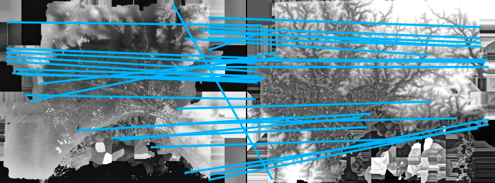

> This research was carried out within the [LaSTIG lab., IGN-ENSG, Univ. Gustave Eiffel.](https://www.umr-lastig.fr/)

# Introduction

Historical imagery is characterized by high spatial resolution and stereoscopic acquisitions, providing a valuable resource for recovering 3D land-cover information. Accurate geo-referencing of diachronic historical images by means of self-calibration remains a bottleneck because of the difficulty to find sufficient amount of feature correspondences under evolving landscapes. As shown in Figure 1 (c-d), current *state-of-the-art* feature matching methods (including SIFT [^1] and SuperGlue [^2]) perfom well on images acquired within the same epoch (also refered to as intra-epoch). Yet, due to drastic scene changes and heterogeneous acquisition conditions, they underperform to find feature correspondences across different epochs (also referred to as inter-epoch) Figure 1 (e-f), while our method [^3] is able to recover numerous and accurate correspondences Figure 1 (g).

|         (a) Intra-epoch image pair        | (b) Inter-epoch image pair |
|-|-|
| 
  
 | 
  
 |
|   
   (c) ***SIFT*** : good correspondences 
 |      
    (d) ***SIFT*** : 0 correspondences  
 |
| 
  
 | 
   
 |
|  
   (e) ***SuperGlue*** : good correspondences 
     |   
   (f) ***SuperGlue*** : inaccurate correspondences  
       |
| 
  
 | 
   
 |
| | 
 (g) ***Ours*** : accurate correspondences 
 |
| |
  
|

 Figure 1. SIFT, SuperGlue and Our features computed on an intra-epoch (left) and inter-epoch (right) image pair. The blue line connecting 2 points from the left and right images represent the feature correspondences. 
 

We propose a fully automatic approach to computing robust inter-epoch feature correspondences. Our method consists of two steps: a rough co-registration by finding feature correspondences between DSMs (Digital Surface Model) derived within single epochs, and a precise feature matching on original RGB images. Our main contributions include:
* Rough-to-precise matching strategy that helps to drastically reduce ambiguity. In particular, we use the depth information to roughly co-register our epochs. The 3D landscape is globally stable over time and provides sufficient correspondences *through time*. Once co-registered, we levarage the 3D *a priori* to narrow down the search space in precise matching. 
* Upscaling of the learning based feature matching algorithms to high resolution imagery. To do that, we introduced an image tiling scheme.

In the following we present the methodology and some experiments. If you are interested in using our method, please refer to the source code of MicMac Github [^4], as well as 2 jupyter tutorials [^5] [^6]. We also provide an introduction video [^7]. The datasets used in our publication [^3] will be soon published in an open-access repository.

# Observation and motivation

The key idea of our method is to use 3D geometry to guide matching. This idea comes from the observation that RGB images have the following shortcomings:
* (1) Appearance changes over time (see Figure 2);
* (2) Hard to match poorly textured areas (see Figure 3).

|         (a) Image 1971        | (b) Image 2015 |
|-|-|
| 
  
 | 
  
 |
|   
   (c) DSM 1971 
 |      
    (d) DSM 2015  
 |
| 
  
 | 
  
 |

 Figure 2. The same zone observed in different time. The images changed a lot while the DSMs stayed stable over time. 
 

|   
   (e) Image 1991 
 |      
    (f) Image 1994  
 |
|-|-|
| 
  
 | 
  
 |
|   
   (g) DSM 1991 
 |      
    (h) DSM 1994  
 |
| 
  
 | 
  
 |

 Figure 3. The same zone observed in different time. The images are poorly textured therefore hard to be matched, while the DSMs are distinctive. 
 

Fortunately, 3D geometry such as DSM, makes up these shortcomings perfectly. Therefore, we designed a rough-to precise matching pipeline to take advantage of DSMs for multi-epoch image alignment by:
* (1) Matching DSM for rough co-registration;
* (2) Reducing ambiguity in precise matching.

The details are presented in the next section.

# Methodology

  

Figure 4. Full processing workflow

Our pipeline consists of 3 parts: ***intra-epoch***, ***inter-epoch*** and ***combined*** (see Figure 4). For the sake of simplicity, we only exhibit the processing flow of two epochs, however, it can be easily extended to more epochs. The inter-epoch part contains the key developments. It matches the DSMs obtained in intra-epoch processing to roughly co-register 2 epochs, and uses it to narrow down the searching space for precise matching. The final correspondences are then used to refine the orientations in the combined processing (i.e., bundle adjustement).

## Rough co-registration

Based on the image orientations and DSM from each epoch, we match the DSMs to roughly co-register the 2 epochs, as shown in Figure 5.

  

Figure 5. Workflow of the rough co-registration

  

Figure 6. Four rotation hypotheses

To increase the robustness of our correspondences, we do the following:

(1) We introduce a tiling scheme and rotation hypotheses. The classical SuperGlue provides unsatisfactory result when applied to large images and it is not invariant to rotations larger than 45◦.

(2) We choose matching DSMs over original RGB images, and it is motivated by several merits:
* Redundancy caused by the forward and side overlapping areas is removed;
* It implicitly enables a follow-up search for globally consistent inliers;
* It decreases the combinatorial complexity caused by rotation ambiguity;
* Even under important scene changes, DSMs generally provide stable information over time.

However, we also considered using orthophotos for the rough co-registration stage. Experiments have demonstrated that fewer matches can be retrieved. This is due to the fact that the scene's radiometry changes are more pronounced than the 3D landscape's evolution. Figure 7 presents a comparison of feature matching performed on RGB images and DSMs (more inliers in DSMs). It also shows the effectiveness of our strategy (SuperGlue combined with tiling scheme, followed by RANSAC) compared to the traditional SuperGlue.

|(a) Multi-epoch orthophoto pair|(b) Multi-epoch DSM pair|
|-|-|
|
 
|
 
|
|
(c) SuperGlue correspondences on orthophotos
|
(d) SuperGlue correspondences on DSMs
|
|
  
|
  
|
|
(e) Our correspondences on orthophotos
|
(f) Our correspondences on DSMs
|
|
  
|
  
|

Figure 7. Comparison of co-registration with orthophotos and DSMs. (a-b) Red rectangles indicate the overlapping area.

 > Note: For more details, please refer to our publication [^3].

## Precise matching

We perform a precise matching under the guidance of the co-registered DSMs. 2 options (guided matching and patch matching) are provide to get tentative inter-epoch correspondences, followed by removing the outliers with 3D RANSAC and cross correlation.

### Get tentative inter-epoch correspondences

* (1) Guided matching is designed for hand-crafted methods like SIFT. We predict the keypoint locaiton from one epoch to another via the co-registered DSM, and search only the neighborhood of the predicted keypoint to reduce ambiguity.
* (2) Patch matching is designed for deep learning methods like SuperGlue. We use the co-registered DSM to predict the corresponding patches, followed with resampling to remove the scale and rotation difference. The patch pair will be feed into SuperGlue to get tentative correspondences.

  

Figure 8. Guided matching and patch matching

### Get enhanced inter-epoch correspondences

We project the tentative correspondences onto respective DSMs to get 3D points, and remove outliers in a RANSAC routine based on 3D
spatial similarity model.

  

Figure 9. 3D RANSAC

### Get final inter-epoch correspondences

We apply cross-correlation for final validation. Feature correspondences with their correlation scores below a predefined threshold
are discarded. The rectangles in the picture below represent the cross-correlation window, false match (red) is eliminated, while true match (blue) is kept.

  

Figure 10. Cross-correlation

# Experiment

## Dataset with drastic scene changes

We test our method on a dataset with drastic scene changes displayed below:

|         (a) Epoch 1954        |         (b) Epoch 2014        |
|-|-|
| 
   
 |
  
 |

Figure 11. Dataset with drastic scene changes

We recover inter-epoch correspondences and refine the image orientations, then calculate DSMs in each epoch and adopt the conception of DoD (Difference of DSMs) for evaluation. Ideally, the DoD should only display the scene changes as shown in the picture below.

  

Figure 12. DoD in ideal case

But in real case, a doom effect as shown below would appear due to poorly estimated camera parameters.

  

Figure 13. DoD in real case

We display 4 sets of DoDs below.

* (1) DoD resulted from orientations based on 3D helmert transformation using 3 manually measured GCPs. This DoD is for comparison. As can be seen, this DoD showed obvious doom effect as the camera parameters of epoch 1954 are poorly estimated.
* (2) DoD resulted from orientations based on 3D helmert transformation using GCPs automatically recovered from our rough co-registration. The systematic error is mitigated, but still obvious.
* (3) DoD resulted from orientations refined in bundle adjustment with our correspondences based on guided matching.
* (4) DoD resulted from orientations refined in bundle adjustment with our correspondences based on patch matching.

In the DoD of (3) and (4), the doom effect is effectively mitigated while the real scene changes are kept, thanks to our numerous and precise inter-epoch correspondences.

  

Figure 14. DoD in real case

A subregion of scene evolution is displayed below, a seaport as well as several new buildings emerged and are well detected with our method.

  

Figure 15. Scene evolution

## Dataset with earthquake

We also applied our method on a dataset that witnessed an earthquake, in order to see if the result is precise enough for detecting earthquake displacement. 
The dataset locates in the north of Awaji Island, Japan. The well-known Kobe earthquake happened here in January 1995. 
The dataset is mainly covered with mountain area and narrow urban zones along the sea (see Figure 16).
We have two sets of images: pre-event acquired in 1991 and post-event acquired in 1995.

  

Figure 16. Scene demonstration

We display 5 sets of ground displacement below.

* (1) Ground truth ground displacement provided by the Japan Meteorological Agency.
* (2) Ground displacement resulted from orientations based on 3D helmert transformation using 3 manually measured GCPs.
* (3) Ground displacement resulted from orientations based on 3D helmert transformation using GCPs automatically recovered from our rough co-registration.
* (4) Ground displacement resulted from orientations refined in bundle adjustment with our correspondences based on guided matching.
* (5) Ground displacement resulted from orientations refined in bundle adjustment with our correspondences based on patch matching.

In (2) and (3), no earthquake fault is observed. However, in (4) and (5), an up-lateral strike-slip movement along the sea is present , which is coherent with (1). It indicates that the refined orientations are precise enough, thanks to our inter-epoch correspondences.

  

Figure 17. Groud displacement

# Conclusion

Our method exploited rough-to-precise matching strategy to reduce ambiguity with the help of the depth information. We also introduced tiling scheme and checking scale and rotation to upscale the matching performance.

Experiments showed that our method is able to mitigate systematic errors induced by poorly estimated camera, and it is robust to drastic scene changes.

# Lesson learned

## 1. It is useful to adopt *a priori* to reduce ambiguity.

As multi-epoch images often display very different appearance, it helps to exploit *a priori* (e.g. depth information extracted from single epoch) to narrow down the searching space. The *a priori* could be used in as many ways as possible. There are at least 3 ways to take advantage of the depth information:
* matching depth images for rough co-reigstration.
* use co-registered depth information to handle scale and rotation difference in 2 ways: (1) for deep learning matching methods such as SuperGlue, get patch pairs free of scale and rotation difference; (2) for hand-crafted mehtods such as SIFT, reject candidate matches whose scales and rotations computed by
SIFT are incoherent with prediction by depth.
* filter candidate matches by projecting them onto depth to get 3D points, followed by running RANSAC on 3D Helmert transformation model.

## 2. Deep learning feature matching methods underperform on high resolution images, it can be improved with tiling scheme.

Deep learning feature matching methods often provide inaccurate features for different reasons:
* network trained on small images in order to perform in real-time, for example SuperGlue;
* features extracted on CNN feature maps with limited spatial resolution, for example D2-Net.

We can obtain accurate features on high resolution images by tiling the input images, and matching the tile pairs in 2 possible ways:
* If no *a priori* is available, it is neccessary to match all the potential tile pairs;
* If *a priori* is available (e.g. the depths are roughly co-registered), it can be used to predict the tile from one image to another.

#  Contact

> lulin.zhang.whu@gmail.com

> ewelina.rupnik@ign.fr

# Reference

[^1]: D. G. Lowe, Distinctive image features from scale-invariant keypoints, International journal of computer vision 60 (2) (2004) 91–110.

[^2]: P.-E. Sarlin, D. DeTone, T. Malisiewicz, A. Rabinovich, Superglue: Learning feature matching with graph neural networks, in: Proceedings of the IEEE/CVF Conference on Computer Vision and Pattern Recognition, 4938–4947, 2020.

[^3]:  ***L. Zhang***, E. Rupnik, M. Pierrot-Deseilligny, [Feature matching for multi-epoch historical aerial images](https://www.sciencedirect.com/science/article/pii/S0924271621002707), ISPRS journal of photogrammetry and remote sensing.

[^4]: MicMac, GitHub, https://github.com/micmacIGN/micmac/tree/master/src/uti_phgrm/TiePHistorical, 2021.

[^5]: [Jupyter tutorial of our method for matching multi-epoch historical aerial images](https://colab.research.google.com/drive/1poEXIeKbPcJT_2hyQOBhzcj1EEhO8OgD)

[^6]: [Jupyter tutorial of our method for matching multi-epoch historical images (aerial and satellite images mixed)](https://colab.research.google.com/drive/14okQ8bBhEZmy6EGRIQvazTqrN39oc_K5)

[^7]: [YouTube: Introduction video for "Feature matching for multi-epoch historical aerial images"](https://youtu.be/Pk0Tvpr5UmQ)
